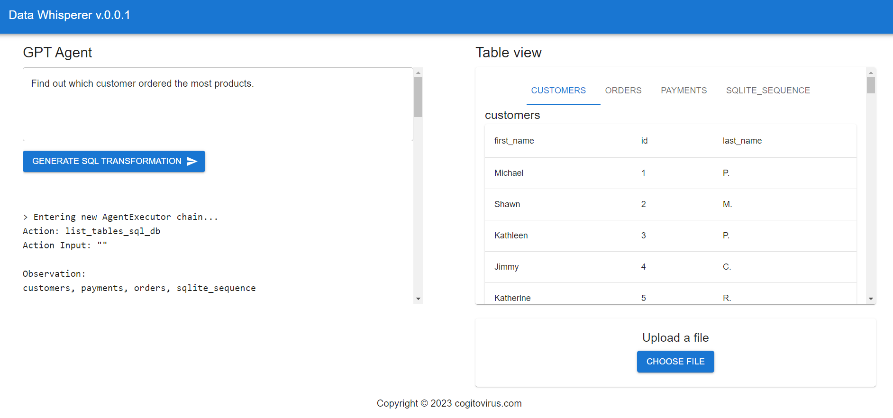
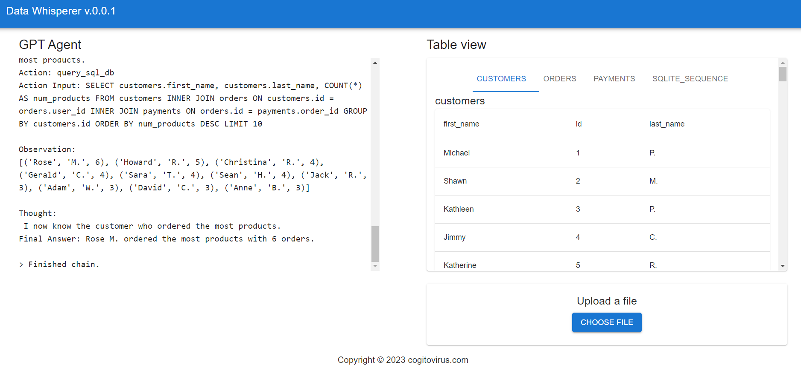

# Langchain SQL Agent Bootstap
This is a simple App for testing LLM to SQL commands on a sqlite database using [Langchain SQL Agent](https://python.langchain.com/en/latest/modules/agents/toolkits/examples/sql_database.html). The repo comes with a setup script that loads a sqlite database with some sample data. You also have the ability to upload your own file (supports csv only)

Backend has several endpoints:
- `/api/v1/tables` - returns a list of tables in the database
- `/api/v1/tables/<table_name>` - returns a list of columns in the table
- `/api/v1/run-command` - takes a json payload with the command to execute and returns the results via a websocket
- `/api/v1/upload` - takes a csv file and loads it into the database

`run-command` is where all the fun is happening with the langchain sql agent.



## TODOs
- [ ] finish implemeting file upload to the UI (currently you can seed the db with `data-whisperer-backend/setup/create_and_seed_db.py`)
- [ ] autorefresh for the tables after commands have been run
- [ ] cleanup the langchain text on the next execute instead of appending to it

## Running locally

### Pre-requisites
Backend was setup with Python 3.10.10

Frontend was setup with Node 18.15.0

Experience may vary with other versions

You have to have an open-api-api-key to use the langchain sql agent.

Copy the `.env.example` file to `.env` and add your key to the `OPENAI_API_KEY` variable. You can also change the model which is used to make predictions. In the time of writing, `gpt-4` is in closed beta, so the backend might not work if you select that model.

### Backend
Create virtual environment (only need to do this once)
```bash
python3 -m venv data-whisperer-backend/myenv
```
activate virtual environment
```bash
source data-whisperer-backend/myenv/bin/activate
# install dependencies
pip install -r data-whisperer-backend/requirements.txt
```
**seed the database**
```bash
python data-whisperer-backend/setup/create_and_seed_db.py
```
finally, run the backend
```bash
python data-whisperer-backend/run.py
```

### Frontend
```bash
cd data-whisperer-ui/
npm install # only need to do this once
npm start
```

## Teardown
```bash
# deactivate virtual environment after you are done
deactivate
```
